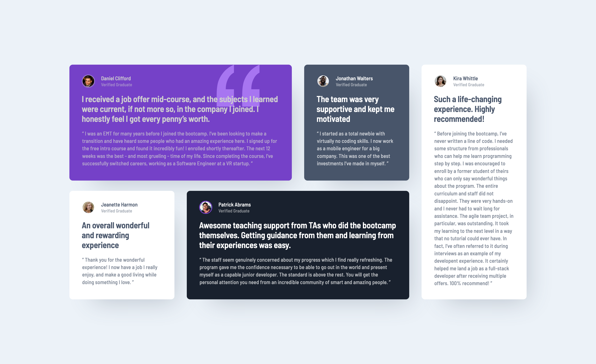

# Frontend Mentor - Testimonials grid section solution

This is a solution to the [Testimonials grid section challenge on Frontend Mentor](https://www.frontendmentor.io/challenges/testimonials-grid-section-Nnw6J7Un7). Frontend Mentor challenges help you improve your coding skills by building realistic projects. 

## Table of contents

- [Overview](#overview)
  - [The challenge](#the-challenge)
  - [Screenshot](#screenshot)
  - [Links](#links)
- [My process](#my-process)
  - [Built with](#built-with)
  - [What I learned](#what-i-learned)
- [Author](#author)

## Overview

### The challenge

Users should be able to:

- View the optimal layout for the site depending on their device's screen size

### Screenshot

### Links

- Solution URL: [FrontendMentor.io](https://www.frontendmentor.io/solutions/testimonial-grid-no-class-names-divs-or-spans-only-semantic-html-ExoIOuIULu)
- Live Site URL: [https://ericsalvi.github.io/testimonials-grid-section/](https://ericsalvi.github.io/testimonials-grid-section/)

## My process

### Built with

- Semantic HTML5 markup
- Pure SCSS and Mixins
- CSS Grid
- Mobile-first workflow

### What I learned

I learned more about using Mixins as I never had a need for them before. The more I use SCSS the more I become fluent with all its features. 

## Author

- Website - [Eric Salvi](https://github.com/ericsalvi)
- Frontend Mentor - [@ericsalvi](https://www.frontendmentor.io/profile/ericsalvi)

